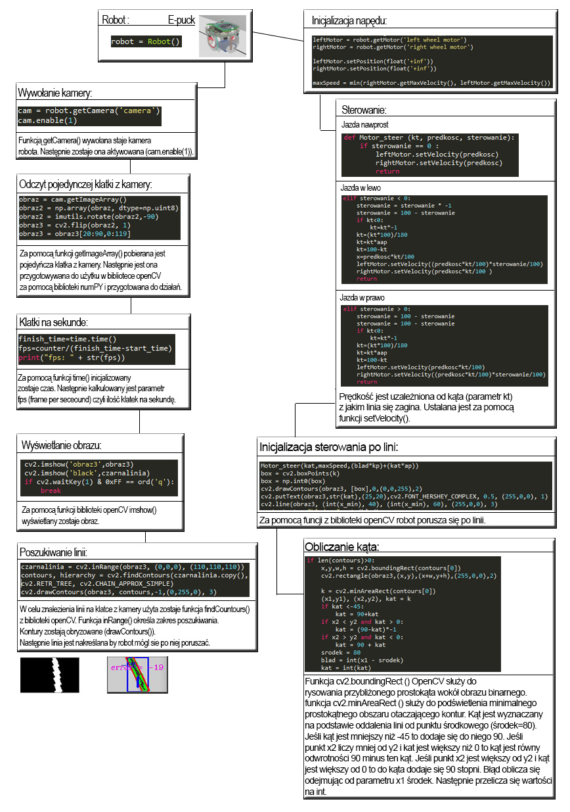

# LineFollower

Projekt  i  implementacja  sterowania  dla  robota  typu  Line-Follower  w  środowisku  symulacyjny mWebots. 
Zadaniem projektanta było wdrożenie i przetestowanie inteligentnego systemu regulacji prędkości jazdy robota, 
tak aby minimalizować czas przejazdu. Adaptacyjne sterowanie prękością przejazduw zależności od kształtu ścieżki 
prowadzącej powinno uwzględniać analizę obrazu z kamery.

